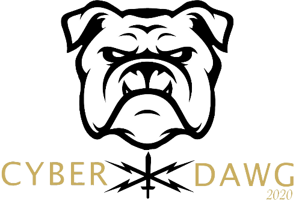
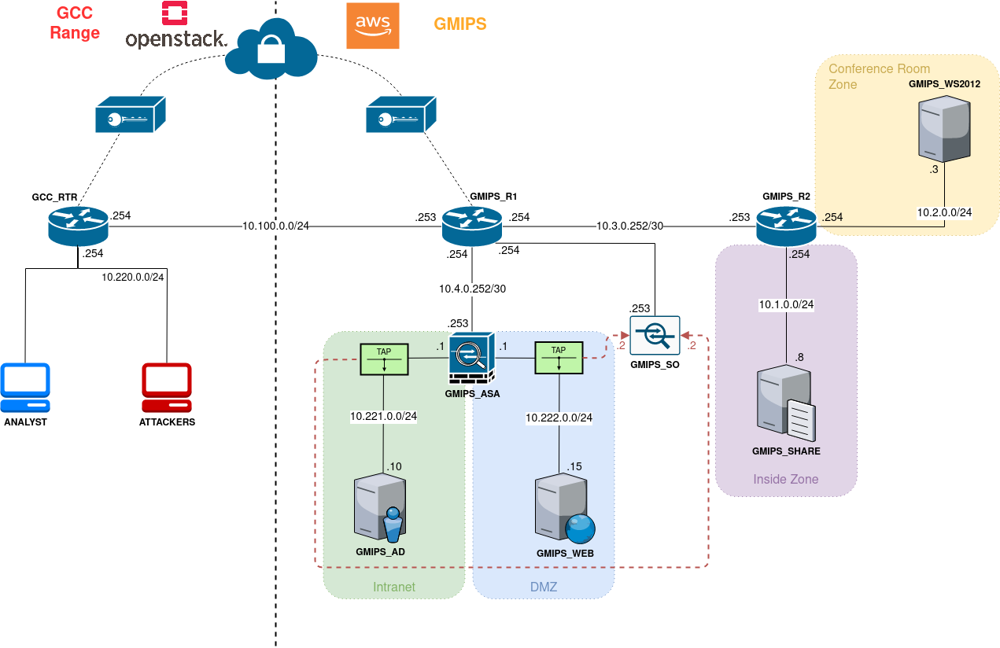

++++
<h1 align="center">Cyber Dawg 2021</h1>
    <h4 align="center">Range Deployment Resources</h4>
++++

---

++++

  <a href="#user-content-basic-overview">Overview</a> •
  <a href="#user-content-usage">Usage</a> •
  <a href="#user-content-features">Features</a> •
  <a href="#user-content-contributing">Contributing</a> •
  <a href="#user-content-author">Author</a> •
  <a href="#user-content-license">License</a>

++++

== Overview
This repository contains the resources for deployment of the Cyber Dawg 2020 range.

== Range Diagram

== Author
Alan Cantrell: alcantrell@augusta.edu +
Nicole Cliff: acliff@augusta.edu

== License
image:https://img.shields.io/badge/License-Apache%202.0-blue.svg[link="https://www.apache.org/licenses/LICENSE-2.0.txt"]
